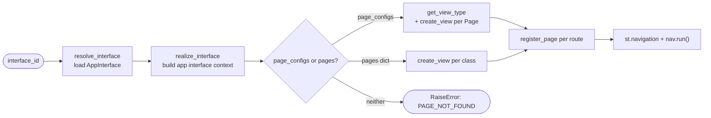

# Core Domain Distillation — Tiferet Streamlit

**Status:** Draft · **Domain:** `tiferet-streamlit` · **Code:** `tiferet_streamlit/` · **Branch:** `main`
**Companion:** `docs/domain-vision.md`

## 1. Purpose of this document

The vision statement says *what* this domain is for. This document says *how it
actually works*: its vocabulary, its behaviors, the conventions those behaviors
depend on, and the seam between what is fixed and what varies per application.
It is the reference a contributor should read before changing anything under
`tiferet_streamlit/`, and the reference a reviewer should read before judging
whether a change belongs.

Where a claim below describes something not yet built, it is marked as such and
grounded in an existing, cited source rather than invented.

## 2. The core domain, restated precisely

This domain's job is **bridging a Streamlit page's browser-facing lifecycle to a
Tiferet application's backend logic, without either side needing to know the
other's internals.**

Every page built on this domain follows the same shape:

> **Construct** → **isolate state** → **render** → **dispatch** → **assemble**

A view is constructed once per session, guards its own one-time setup, reads and
writes state that cannot collide with any other view's state, renders itself
(optionally through smaller sub-components), hands work off to the backend by
name, and is finally registered alongside its sibling views into one navigable
application.

The domain has exactly two axes of variation:

1. **View behavior** — what a concrete view or sub-component actually does
   inside its own setup and rendering code. The framework prescribes *when*
   that code runs and *what* it can reach; it never prescribes *what it does*.
2. **Assembly source** — whether the set of pages that make up a running app is
   declared directly in Python (a mapping of routes to view classes) or as data
   (a list of config objects resolved by dotted import path at assembly time).

Everything else — the one-time-initialization guard, state namespacing, the
sub-component calling convention, the dispatch calling convention, and page
registration — is identical regardless of either axis. That asymmetry is the
most useful fact this document can state, and Section 8 treats it directly.

## 3. Ubiquitous language

**View** — the general concept of a page's code-behind logic. Concretely
realized as a `ViewContext` subclass.

**ViewContext** — the base class every view subclasses. Owns one-time
initialization, a namespaced state store, and the ability to dispatch work to
the backend.

**ViewComponent** — a stateless, prop-driven sub-unit of a view. Renders using
its parent `ViewContext`'s state and dispatch capability, but never owns state
of its own.

**Session cache** — the per-view store of values that survive from one
Streamlit rerun to the next, implemented by `SessionCacheContext` over
Streamlit's own `st.session_state`.

**Namespace** — the prefix (defaulting to a view's key) that scopes session
cache keys so unrelated views cannot read or overwrite each other's state.

**Route** — the URL path string identifying a page (for example `/home`).

**Page** — a data-only description of a page: its route, title, icon, layout,
and a dotted module path plus class name identifying the view that implements
it. Used only when a page is assembled from configuration rather than from a
directly-referenced class.

**PageContext** — the registry that holds route-to-(view, title, icon)
associations and turns them into Streamlit's own navigation.

**Dispatch** — the act of a view handing a named piece of work to the backend
and receiving a result.

**Feature** — a unit of backend business logic, identified by a string id (for
example `'calc.add'`), executed by the underlying Tiferet application. This
domain never knows what a feature does — only how to ask for one.

**App interface context** — the object, supplied by the Tiferet framework, that
resolves and executes features. A view receives one by injection; it never
constructs one itself.

**Blueprint** — a stateless orchestration function that assembles views,
pages, and the app interface context into a running application. Blueprints
compose; they do not implement business or rendering logic of their own.

## 4. What this domain reads and operates on

The entry point is `build_streamlit_app(interface_id, pages=None,
page_configs=None, **parameters)` (`tiferet_streamlit/blueprints/streamlit.py`
(126-167)). Its inputs are:

- An `interface_id` string, resolved into a live app interface context via the
  underlying Tiferet framework.
- Either `pages` — a `Dict[route, ViewContext subclass]` declared directly in
  code — or `page_configs` — a `List[Page]` declared as data. `page_configs`
  takes precedence when both are supplied.

The convention that gives this domain its leverage is that **a view's key
equals its route**, and every page-construction path (`build_pages`,
`build_pages_from_config`) enforces this automatically. Because
`SessionCacheContext` namespaces state by key (Section 5.2), and Streamlit's
own navigation already requires unique routes, state isolation between pages
falls out of that one convention for free — as long as a view is never
constructed with some other, hand-picked key. Section 8 records the one place
that guarantee is not enforced.

## 5. The behaviors

### 5.1 Construction and one-time initialization
*Guard a view's setup code so it runs exactly once per session, no matter how
many times Streamlit reruns the script.*

`ViewContext.__init__` (`tiferet_streamlit/contexts/view.py` (35-63)) stores
the injected app interface context and view key, creates or accepts a
`SessionCacheContext`, and checks a private `_initialized` flag in that session
before calling the subclass's `init_state()`. Confirmed by
`test_init_state_called_once`, `test_init_state_not_called_again`, and
`test_default_init_state_is_noop`
(`tiferet_streamlit/contexts/tests/test_view.py` (109-169)).

**Agnostic.** The guard mechanism is identical for every view; only the
content of `init_state()` (axis 1) varies.

### 5.2 Namespaced state access
*Read and write values that persist across reruns, scoped so unrelated views
cannot collide.*

`SessionCacheContext` (`tiferet_streamlit/contexts/session.py`) builds a
namespaced key in `_key()` (38-53) by prefixing with `{namespace}.`; `get`,
`set`, and `delete` (55-93) proxy directly to `st.session_state`; `clear()`
(96-114) removes only that namespace's keys, or everything when unnamespaced.
`ViewContext` auto-creates one with `namespace=key` (`view.py:58`) unless a
caller supplies a shared instance.

**Agnostic**, with one caveat: nothing in `_key()` (session.py:49-50) checks
that a namespace is actually unique — see Section 8.

### 5.3 Composition via sub-components
*Let a view break its rendering into stateless, prop-driven pieces that share
its state and dispatch capability without owning either.*

`ViewComponent` (`view.py` (121-163)) is constructed with a reference to its
parent `ViewContext` as `ctx`. `__call__(**props)` (154-163) delegates to
`render(**props)`, which subclasses override; a component reaches state and
dispatch only through `self.ctx`. Confirmed by
`test_component_accesses_parent_dispatch` (`test_view.py` (372-387)).

**Agnostic** mechanism; a concrete component's rendering content is axis-1
variable.

### 5.4 Feature dispatch
*Hand a named unit of backend work to the underlying Tiferet application and
return its result.*

`ViewContext.dispatch()` (`view.py` (74-97)) calls
`self.app.run(feature_id=feature_id, headers=headers or {}, data=data)`, with
`data` built from keyword arguments. `self.app` is injected, never
constructed, by this module. Confirmed by `test_dispatch_calls_app_run` and
`test_dispatch_with_headers` (`test_view.py` (175-218)).

**Agnostic** on the calling convention. The feature id and what it does are
entirely axis-1, owned by the backend a given view is wired to — this domain
does not, and by design should not, know what a feature does.

### 5.5 Page registration and navigation assembly
*Turn a set of (route, view, title, icon) records into Streamlit's own
multi-page navigation.*

`PageContext.register_page()` (`tiferet_streamlit/contexts/page.py` (39-64))
stores metadata in a plain dict keyed by route, defaulting title to the route
and icon to `None`. `PageContext.run()` (66-95) builds one `st.Page(...)` per
entry and calls `st.navigation(...).run()`. Confirmed by the
`register_page_*` tests and `test_run_calls_st_navigation`
(`tiferet_streamlit/contexts/tests/test_page.py` (69-107, 222-258)).

**Agnostic.** Every registered page is handled identically regardless of how
it was declared (axis 2).

### 5.6 Page resolution from configuration
*Turn a data-only page description into a live view instance, without the
assembling code importing the view class directly.*

`Page.get_view_type()` (`tiferet_streamlit/domain/view.py` (59-74))
dynamically imports `view_module_path` and looks up `view_class_name`.
`build_pages_from_config()` (`blueprints/streamlit.py` (86-122)) calls this
for each `Page`, then `create_view()` to instantiate it, keyed by
`page.route`. `build_pages()` (53-82) is the direct-reference sibling: it
skips resolution entirely because the caller already supplied the class.
`build_streamlit_app()` (126-167) prefers `page_configs` over `pages` when
both are given, confirmed by
`test_build_streamlit_app_page_configs_take_precedence`
(`tiferet_streamlit/blueprints/tests/test_streamlit.py` (309-359)), and raises
`PAGE_NOT_FOUND_ID` via `RaiseError` when neither is given, confirmed by
`test_build_streamlit_app_no_pages_raises_error` (`test_streamlit.py`
(283-306)).

**Variable — this is axis 2 made concrete.** It is the one behavior that only
exists because the assembly source can differ. Section 8 revisits how thin
that difference actually is underneath.

## 6. How the behaviors compose

`build_streamlit_app()` is the one declared pipeline; `run()`
(`blueprints/streamlit.py` (171-196)) is a thin alias for it. There is no
configuration-driven pipeline composition here — unlike the wider Tiferet
framework's `feature.yml`, this domain's single pipeline is fixed in code,
with exactly one branch point (which page-declaration shape was supplied).

## 7. Relationships and cross-boundary rules

Tracing actual imports shows a consistent, if unenforced, layering:

- `domain/view.py` depends only on the Tiferet framework's `DomainObject` base
  and the standard-library `importlib`. It has no dependency on `contexts`,
  `interfaces`, or `blueprints`.
- `interfaces/view.py` depends on the Tiferet framework's `Service` base and
  `domain.view.Page`. It declares a contract but, per Section 8, nothing
  implements it.
- `contexts/session.py` depends only on the Tiferet framework's `CacheContext`
  base and `streamlit` itself.
- `contexts/view.py` depends on the Tiferet framework's `AppInterfaceContext`
  (received by injection, never constructed here) and the sibling
  `contexts/session.py`.
- `contexts/page.py` depends on the sibling `contexts/view.py` and `streamlit`.
- `blueprints/streamlit.py` is the only module that calls
  `tiferet.blueprints.main.resolve_interface` /
  `realize_interface`, and the only module that raises a structured error via
  `tiferet.events.static.RaiseError`. It draws on `contexts`, `domain`, and
  `assets`.

The one relationship rule worth stating explicitly: **only the blueprint layer
resolves an interface or raises a domain error; every context receives its
collaborators by injection.** This rule is observed everywhere it applies
today, but it is a convention, not something enforced by import restrictions
or a test — nothing stops a future `ViewContext` subclass from importing
`resolve_interface` directly.

Judging whether a given running app's page set came from `pages` or
`page_configs` requires a specific input — which keyword argument was actually
passed to `build_streamlit_app()` — because both branches converge on an
identical `PageContext` shape immediately afterward (Section 6). Nothing about
a registered page, once assembled, records which axis-2 path produced it.

## 8. The agnostic core and the variable edge

**Agnostic — built once, used identically everywhere:**
- The one-time-initialization guard (`_initialized`).
- Session-cache namespacing mechanics.
- `ViewComponent`'s prop-forwarding call convention.
- The `dispatch()` calling convention into the app interface context.
- `PageContext`'s registration shape and `st.Page`/`st.navigation` assembly.

**Variable — one definition per case:**
- What a concrete `init_state()` / `render()` actually does (axis 1).
- Whether a page's view is supplied directly as a class or resolved from a
  `Page` config object via dotted import path (axis 2).

**Currently entangled — the honest inventory:**
- `pyproject.toml:13` pins only a lower bound, `tiferet>=2.0.0b3`, on the
  single dependency this entire domain is built against. The installed
  `2.0.0b3` package's `AppInterfaceContext.run(feature_id, headers, data)`
  (site-packages `tiferet/contexts/app.py`) is the exact shape `dispatch()`
  (Section 5.4) calls against — but the framework's own trunk has since
  replaced that class with `AppSessionContext`, built around injected
  template-method handlers with a different `run()` contract. Nothing in this
  repository would catch that shift before it broke `dispatch()` at runtime.
- `ViewService` (`interfaces/view.py` (18-45)) declares `get_page` and
  `list_pages`, but no module under `repos/` or `mappers/` implements it —
  both packages are placeholder-only (`repos/__init__.py`,
  `mappers/__init__.py`). `build_pages_from_config()` (`blueprints/streamlit.py`
  (86-122)) takes its `List[Page]` directly from the caller; the one place a
  `ViewService`-backed configuration store would plug in does not exist yet.
- `assets/constants.py` declares `VIEW_NOT_INITIALIZED_ID` (5-6),
  `VIEW_RENDER_FAILED_ID` (11-12), and `INVALID_VIEW_TYPE_ID` (14-15), but
  nothing in `tiferet_streamlit/` raises any of them — only
  `PAGE_NOT_FOUND_ID` is ever used (`blueprints/streamlit.py` (162-164)).
  Three named error conditions exist only in name; the initialization
  lifecycle (5.1), dynamic import resolution (5.6), and view-type validation
  they imply have no code path that actually detects and raises them.
- Two independently constructed views sharing a `key` also share a session
  namespace (`session.py` (49-50)) and silently merge state — nothing checks
  key uniqueness. `build_pages`/`build_pages_from_config` can't produce this,
  since both key by route and Streamlit's own navigation already requires
  unique routes, but a view constructed directly (as `ViewComponent`'s own
  usage guide shows) has no such guard.
- `utils/widgets.py` is a docstring only. This placeholder is itself the
  entanglement: unlike `PageContext`, which already generalizes cleanly across
  pages, there is no existing partial widget-binding mechanism to extend —
  any future helper here is new code, not a generalization.

The entanglement is small and specific, which is the encouraging part. None of
it requires redesigning the fixed pipeline in Section 2; it requires either
wiring an already-declared contract to a real implementation, or adding
narrowly-scoped new code alongside what already works.

## 9. Boundaries

**Inside the domain:** page construction and one-time setup, state isolation,
sub-component composition, the dispatch calling convention, page registration,
and config-driven page resolution.

**Outside the domain:**
- What a feature does, how it validates input, and how it enforces business
  rules — owned by the Tiferet backend application a view dispatches into.
- Streamlit's own widget rendering, its native theming and CSS configuration,
  and its rerun execution model — owned by Streamlit itself; this domain
  reaches those systems, it does not reimplement them.
- Resolving an `interface_id` into a running app interface context — owned by
  `tiferet.blueprints.main`, an upstream Tiferet concern this domain calls
  exactly once, in `build_streamlit_app()`.
- Persisting anything beyond a single browser session — currently owned by no
  one. `SessionCacheContext` is explicitly in-memory only, and no repository
  backs it.

## 10. Where this leads

1. **Widget-binding helpers.** A small layer in `utils/widgets.py` that reads
   and writes a `SessionCacheContext` key and optionally calls `dispatch()`
   from a native Streamlit widget's `on_change`/`on_click`, replacing the
   hand-wired pattern every current example repeats (Sections 5.2, 5.4, and
   the `utils/widgets.py` entanglement item).
2. **Dispatch audit logging.** Wrap `dispatch()` (Section 5.4) so each call
   appends a record — feature id, arguments, result — to a log, in-session at
   minimum. Deliberately short of event-sourced replay, matching the smaller
   claim named in the vision statement.
3. **Config-driven theming.** A configuration surface, read at
   `build_streamlit_app()` time, that maps onto Streamlit's native
   theme/CSS-injection points — mirroring how `Page` already declares routing
   as data (Section 5.6).
4. **Wire `ViewService` to a real store.** Implement it under `repos/`/
   `mappers/` so `build_pages_from_config()` can load `Page` objects from
   configuration instead of requiring the caller to construct them in Python,
   closing the second entanglement item in Section 8.
5. **Resolve the three unused error constants.** Give
   `VIEW_NOT_INITIALIZED_ID`, `VIEW_RENDER_FAILED_ID`, and
   `INVALID_VIEW_TYPE_ID` real call sites — for example in
   `get_view_type()`'s import/attribute-lookup failure paths — or remove them,
   closing the third entanglement item in Section 8.
6. **Track the `tiferet` dependency more defensively.** Either an upper bound
   on `pyproject.toml:13` or a compatibility check against upstream's
   `AppSessionContext` shape, closing the first entanglement item in Section
   8.

Each is a candidate for its own RFP. Together they are the difference between
a domain that bridges Streamlit and Tiferet for the cases already tested, and
the domain the vision statement describes.
